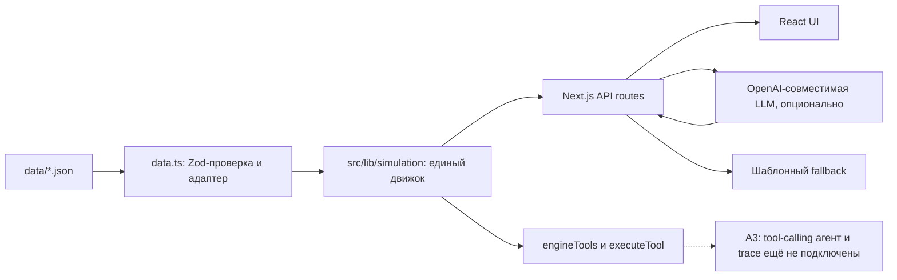
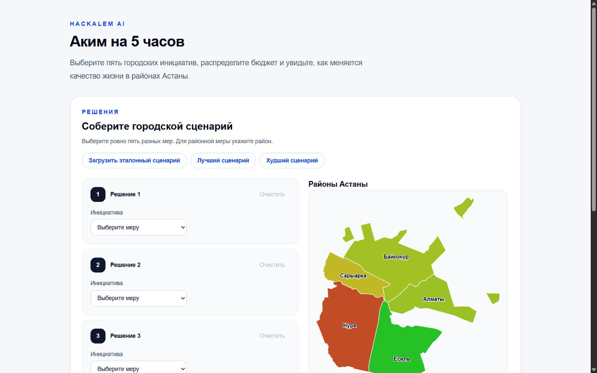
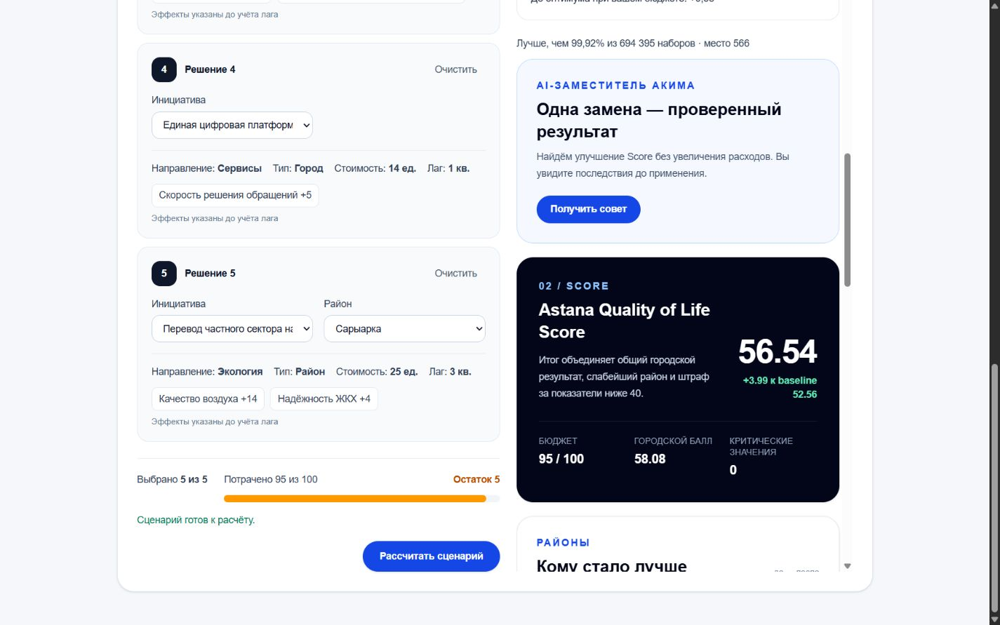
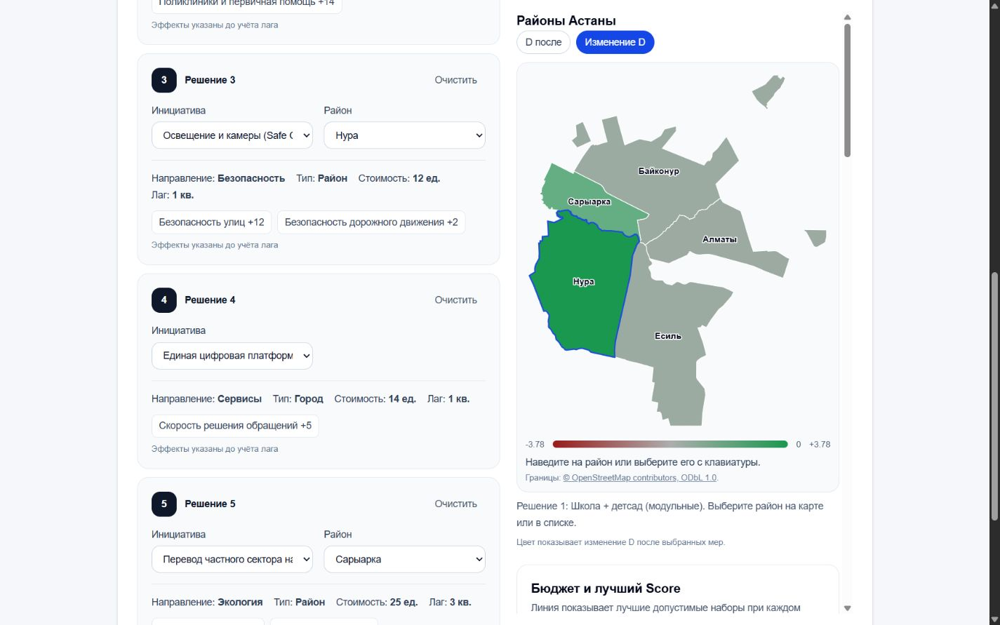
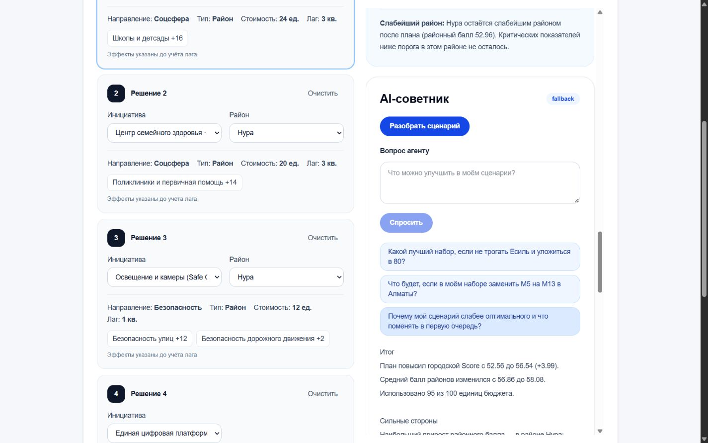
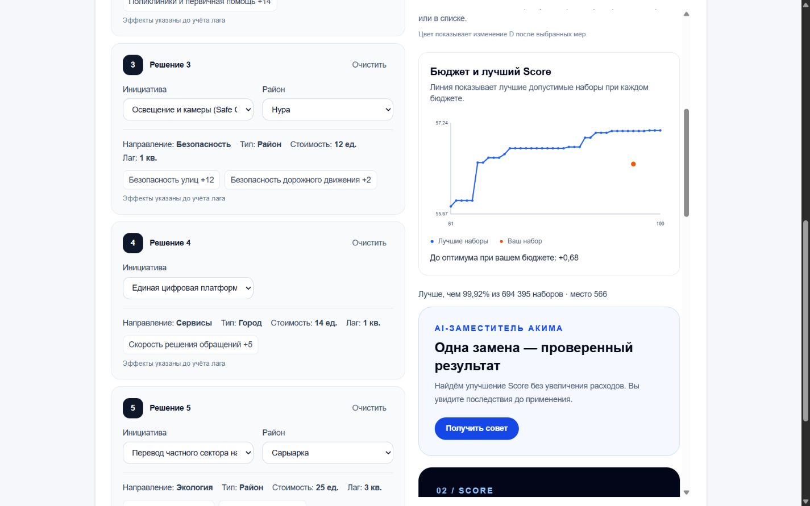

# Аким на пять часов

Интерактивный симулятор городских решений для городских аналитиков и жюри: он показывает, как выбранные инициативы меняют показатели районов и общий Score.

Данные в симуляции синтетические; результат объясняет модель, а не прогнозирует фактический эффект муниципальной политики.

## 2. Быстрый старт

### Docker Compose

Из корня репозитория, если локального файла .env ещё нет:

```sh
cp .env.example .env
docker compose up
```

Откройте http://localhost:3000. Если .env уже существует, сохраните его и не копируйте поверх.

Compose собирает Next.js standalone-образ из [Dockerfile](Dockerfile) и публикует порт, заданный в [docker-compose.yml](docker-compose.yml). При пустых ключах приложение работает в fallback-режиме. На машине, где готовился этот README, Docker CLI отсутствует, поэтому контейнерный запуск здесь не проверен.

### Локальный запуск

```sh
npm ci
npm run dev
```

Откройте http://localhost:3000. Локальные команды проверены; тесты запускаются командой npm test.

### LLM и OpenAI-совместимые серверы

LLM необязателен. Без ключа /api/analyze возвращает шаблонную записку из результата симуляции, а /api/advice формирует проверенное движком предложение и резервное объяснение.

Переменные для текущих серверных маршрутов:

| Переменная | Использование |
|---|---|
| OPENAI_API_KEY | Ключ для /api/analyze; если пустой, используется fallback |
| OPENAI_MODEL | Модель для /api/analyze; по умолчанию gpt-4o-mini |
| OPENAI_BASE_URL | Необязательный базовый URL SDK для /api/analyze |
| LLM_API_KEY | Ключ для /api/advice; при отсутствии используется OPENAI_API_KEY |
| LLM_BASE_URL | Базовый URL OpenAI-совместимого Chat Completions API для /api/advice |
| LLM_MODEL | Модель для /api/advice; далее используются OPENAI_MODEL или gpt-4o-mini |

Скопируйте [пример переменных](.env.example) в .env для Docker или задайте их в .env.local для локального запуска. Никогда не помещайте действующие ключи в Git.

Для OpenAI используйте https://api.openai.com/v1 и модель, доступную вашему аккаунту. Для собственного vLLM задайте его OpenAI-совместимый endpoint, ключ, который настроен на сервере, и точное имя опубликованной модели. Например, в локальном .env.local:

```dotenv
OPENAI_BASE_URL=http://<vllm-host>:<port>/v1
OPENAI_API_KEY=ваш_ключ
OPENAI_MODEL=имя_опубликованной_модели
LLM_BASE_URL=http://<vllm-host>:<port>/v1
LLM_API_KEY=ваш_ключ
LLM_MODEL=имя_опубликованной_модели
```

В Docker endpoint должен быть доступен из контейнера. [Entrypoint](scripts/docker-entrypoint.mjs) передаёт LLM_* переменные в прежние OPENAI_* имена, которые использует /api/analyze.

## 3. Что реализовано

| Требование ТЗ | Как реализовано | Где в коде |
|---|---|---|
| Конструктор сценария и районное размещение | Интерфейс собирает сценарий, показывает стоимость и валидирует вход через общий движок | [ScenarioBuilder](src/components/scenario/ScenarioBuilder.tsx), [validate.ts](src/lib/simulation/validate.ts) |
| Расчёт последствий инициатив | Движок применяет эффекты с лагами и синергиями, ограничивает показатели и возвращает результаты по районам | [simulate.ts](src/lib/simulation/simulate.ts), [numeric.ts](src/lib/simulation/numeric.ts), [ResultsDashboard](src/components/results/ResultsDashboard.tsx) |
| AI-анализ результата | /api/analyze вызывает модель только для текстовой записки; без ключа отдаёт шаблон на рассчитанных данных | [route.ts](src/app/api/analyze/route.ts), [analysis.ts](src/lib/analysis.ts) |
| Рекомендация и применение безопасной одиночной замены | /api/advice ищет вариант через движок, проверяет его, UI показывает сравнение до применения и поддерживает отмену; LLM формулирует объяснение | [advice route](src/app/api/advice/route.ts), [advice.ts](src/lib/simulation/advice.ts), [AdviceCard](src/components/results/AdviceCard.tsx) |
| Оптимум и Парето | Полный перебор, ограничения поиска, лучший/худший набор, ранг, swaps, Парето и таймлайн реализованы в серверном движке; вкладки Парето и таймлайн в UI ещё не подключены | [optimizer.ts](src/lib/simulation/optimizer.ts), [timeline.ts](src/lib/simulation/timeline.ts), [тесты движка](tests/optimizer.test.ts); U5 — в [плане](docs/PLAN.md) |
| Карта районов | GeoJSON сохранён, включая схематичную геометрию Алматы; React-карта и её вкладка ещё не реализованы | [GeoJSON](data/geo/astana_districts.geojson), [описание геоданных](data/geo/README.md); E5/U7 — в [плане](docs/PLAN.md) |
| События и сравнение команд | Не реализовано; события и лидерборд сняты с текущего объёма, сравнения команд в приложении нет | [план проекта](docs/PLAN.md) |

## 4. Архитектура



Числа и валидность сценария определяет только движок. LLM получает рассчитанные данные и пишет объяснение; она не устанавливает Score и не применяет сценарий. AI-tools экспортированы для серверного использования, но цикл агента и trace в текущем приложении отсутствуют.

| Папка или файл | Назначение |
|---|---|
| data/*.json | Исходные данные районов, мер и параметров |
| data/geo/ | Геометрии районов и описание источника/схематичной границы |
| src/lib/simulation/ | TypeScript-движок: загрузка данных, валидация, расчёт, оптимизатор, timeline и tools |
| src/app/api/ | Серверные маршруты /api/analyze и /api/advice |
| src/components/scenario/ | Сборка пользовательского сценария |
| src/components/results/ | Score, районные результаты, AI-анализ и карточка совета |
| tests/ | Vitest-проверки расчётов, оптимизатора, API, advice, геоданных и статус-доски |
| scripts/ | Команды status, Docker entrypoint и служебные скрипты |

## 5. Модель расчёта

Для каждой меры движок берёт эффекты из данных, учитывает её лаг L и, если условия выполнены, синергию. В таймлайне доля эффекта в квартале q равна max(0, q−L)/8; синергия включается только при q > max(L₁, L₂). На последней точке timeline результат совпадает с обычной оценкой сценария.

Далее для каждого показателя района движок суммирует эффекты и ограничивает значение диапазоном 0–100 (clip). Районный балл D — взвешенная сумма его показателей. Городской D_avg — средневзвешенное значение районных баллов по долям населения. N_crit — число показателей ниже 40.

```text
Score = 0.7 × D_avg + 0.3 × min(D района) − N_crit
```

Таким образом, 30% Score зависят от слабейшего района, а каждый показатель ниже порога уменьшает Score на единицу. Округление применяется для отображения, не для внутреннего расчёта.

Валидатор проверяет ровно пять разных мер, общий бюджет не выше 100, не больше двух мер одного направления, наличие района только у районной меры и отсутствие конфликтующих мер. Пустой сценарий движок использует для baseline; конструктор требует полный набор. Правила и эталоны покрыты тестами в [simulation.test.ts](tests/simulation.test.ts).

- Пустой сценарий: Score 52.56, D_avg 56.86, N_crit 2.
- Эталон: M7 в Нуре, M8 в Нуре, M10 в Нуре, M12 для города, M5 в Сарыарке; стоимость 95, Score 56.54 ±0.01.
- В эталоне активируется синергия M10 + M12.

Числа эталонов также собраны в [ENGINE_RESULTS.md](docs/ENGINE_RESULTS.md).

## 6. Оптимизатор и аналитика

Оптимизатор проверяет все допустимые сочетания и размещения: в актуальном каталоге это 694395 валидных сценариев. Холодный полный перебор с материализацией результатов занял 2.12 с на Windows с Node 22.23.2; результат мемоизируется на время жизни серверного модуля. Замер и контрольные результаты — в [ENGINE_RESULTS.md](docs/ENGINE_RESULTS.md), проверка числа сценариев — в [optimizer.test.ts](tests/optimizer.test.ts).

### Лучшие найденные сценарии

| Меры | Стоимость | Score | D_min | N_crit |
|---|---:|---:|---:|---:|
| M2, M3, M8, M9, M14 | 98 | 57.236735 | 54.091250 | 0 |
| M3, M4, M8, M9, M14 | 91 | 57.225545 | 54.781250 | 0 |
| M3, M7, M8, M10, M12 | 100 | 57.205560 | 54.982500 | 0 |

Во всех этих наборах районные меры размещены в Нуре; M2, M12 и M14 — городские. Это согласуется с формулой: слабейший район входит в Score с весом 30%, а показатели ниже 40 штрафуются. Это вывод из формулы и найденных сценариев, а не отдельное правило оптимизатора.

Худший допустимый сценарий: M8 Байконур, M9 Байконур, M10 Байконур, M11 Алматы и M13 Байконур; стоимость 80, Score 52.04091625, D_min 49.18 в Нуре, N_crit 3. Эталонный сценарий занимает rank 566 из 694395, его percentile — 99.9184901965% наборов имеют строго худший Score.

### Фронт Парето, step=5

| Лимит бюджета | Стоимость набора | Лучший Score | Меры |
|---:|---:|---:|---|
| 40–60 | — | нет валидных наборов | — |
| 65 | 62 | 55.788575 | M9, M10, M11, M12, M14 |
| 70 | 68 | 56.673465 | M8, M9, M10, M11, M14 |
| 75 | 72 | 56.867885 | M8, M9, M10, M12, M14 |
| 80 | 72 | 56.867885 | M8, M9, M10, M12, M14 |
| 85 | 83 | 56.895805 | M2, M4, M8, M9, M14 |
| 90 | 88 | 57.188465 | M3, M8, M9, M10, M14 |
| 95 | 91 | 57.225545 | M3, M4, M8, M9, M14 |
| 100 | 98 | 57.236735 | M2, M3, M8, M9, M14 |

При лимитах 65 и 70 Score растёт на 0.884890; между лимитами 95 и 100 — на 0.011190. Это показывает меньший прирост у верхнего конца бюджета в этих контрольных точках. Кривая не убывает строго на каждом шаге: между лимитами 85 и 90 есть скачок на 0.292660. Все точки получены перебором и описаны в [ENGINE_RESULTS.md](docs/ENGINE_RESULTS.md).

Движок также рассчитывает квартальный timeline с долей эффекта max(0, q−L)/8. Его последняя точка равна итоговому Score по тесту; сами timeline и Pareto уже доступны движку, UI-вкладки пока нет.

## 7. AI-анализ и состояние агента

Работающий UI предоставляет две серверные функции:

- /api/analyze формирует записку по уже рассчитанному результату; без ключа использует fallback.
- /api/advice ищет допустимое улучшение одной заменой без увеличения расходов. Движок независимо пересчитывает и проверяет совет перед показом, а пользователь может применить его или отменить. Без LLM доступно шаблонное объяснение.

Движок экспортирует восемь tools: evaluate_scenario, validate_scenario, find_best, find_worst, suggest_swaps, pareto, timeline и score_rank. Их схема и диспетчер находятся в [tools.ts](src/lib/simulation/tools.ts). Это инструменты движка, а не уже работающий цикл AI-агента.

В main пока нет A3 tool-calling агента, режимов explain/chat и ответа с trace; соответствующие задачи A3/A4 и U4 остаются незавершёнными. Поэтому фактический пример вызова инструмента и trace здесь не приведён.

<!-- AGENT_EXAMPLE -->
<!-- TODO: добавить проверенный вопрос и реальный trace после интеграции A3; сейчас агента в main нет. -->

Плановый пример вопроса: «Подбери лучший набор без Есиля при бюджете до 80». Ограничения движок уже поддерживает; ответ агента и trace появятся после реализации A3.

## 8. Демо-сценарий из плана

| Шаг | Действие | Состояние в main |
|---:|---|---|
| 1 | Загрузить эталон, рассчитать Score и посмотреть результаты районов | Доступно |
| 2 | Открыть карту районов и найти слабейший район | Ждёт E5/U7: карта в UI не реализована |
| 3 | Посмотреть изменение Score по кварталам с учётом лагов | Расчёт движка готов; вкладка ждёт U5 |
| 4 | Сравнить сценарий с фронтом Парето | Расчёт движка готов; вкладка ждёт U5 |
| 5 | Спросить агента про лучший набор без Есиля при ограничении бюджета и посмотреть trace | Ждёт A3/U4: tool-calling агент и trace не реализованы |
| 6 | Получить совет об одиночной замене, проверить компромисс, применить его и отменить | Доступно через AI-карточку; проверку поддерживают advice-тесты |
| 7 | Убедиться, что без LLM-ключа расчёт и fallback продолжают работать | Доступно |

План с дедлайнами и текущими тикетами — [docs/PLAN.md](docs/PLAN.md); доска читает абсолютные часы из [META.md](docs/status/META.md).

## 9. Тесты

```sh
npm test
```

Для версии main в этом репозитории проверены **92 теста в 6 отслеживаемых файлах**. Покрыты baseline и эталонный сценарий, валидатор, полный перебор и ограничения, best/worst/rank, инструменты движка, Парето и timeline, fallback, проверка совета и Apply/Undo, API, геоданные и скрипт статусов.

Для проверки стиля используется npm run lint.

## 10. Скриншоты

Изображения добавляет UI в docs/screenshots/. Пока файлов нет; ниже — места для будущих скриншотов.











## 11. Ограничения и развитие

- Каталог и исходные значения синтетические, не являются официальной статистикой акимата.
- Геометрия Алматы схематичная; GeoJSON используется из локального файла, runtime-запрос к Overpass не нужен.
- React-карта, вкладки Парето и timeline, tool-calling агент и trace пока не подключены.
- События и лидерборд вырезаны из текущего объёма; сравнения команд, многопользовательский режим и хранение пользовательских данных не реализованы.
- Возможное развитие: подключить открытые данные акимата, добавить события, режим нескольких команд и калибровку весов модели. Эти функции не входят в текущую реализацию.

## 12. Команда

Роли приведены по [META.md](docs/status/META.md).

| Зона | Владелец | Ответственность |
|---|---|---|
| engine | Шахнияр | Движок, данные, тесты, документация и полный README |
| ai | Дамир | Серверная AI-интеграция |
| ui | Расул | Интерфейс и файлы изображений в docs/screenshots/ |
