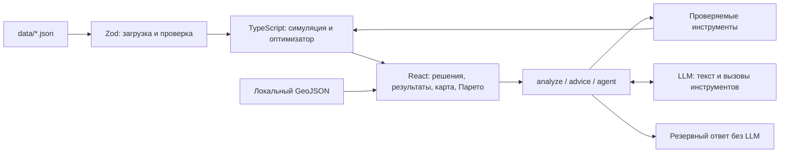

# Аким на 5 часов

AI-симулятор управления городом для HackAlem AI. Задача Astana Innovations: распределить бюджет **100 условных единиц между пятью инициативами** и увидеть последствия для районов Астаны.

Пользователь собирает план, получает Astana Quality of Life Score, сравнивает его с другими допустимыми наборами и может применить проверенный совет AI. Все числовые результаты рассчитывает детерминированный TypeScript-движок; языковая модель объясняет результаты и вызывает инструменты анализа.

## Быстрый запуск

Нужны Node.js 20.9+ и npm. Для локальной разработки проверен Node.js 22.

```sh
npm ci
npm run dev
```

Откройте [localhost:3000](http://localhost:3000). Без API-ключа работают расчёты, карта, оптимизатор, Парето и шаблонные объяснения.

Для включения AI скопируйте [.env.example](.env.example) в `.env.local`, если этого файла ещё нет:

```sh
# macOS / Linux
cp .env.example .env.local

# Windows PowerShell
Copy-Item .env.example .env.local
```

Вставьте ключ в `LLM_API_KEY` и перезапустите приложение. Пример уже связывает `OPENAI_API_KEY` и `OPENAI_MODEL` с `LLM_*`, чтобы включить все три AI-маршрута. Существующий файл с ключами не перезаписывайте.

### Docker Compose

Нужны Docker и Docker Compose 2.24+. Запуск без ключа и файла `.env`:

```sh
docker compose up --build
```

Для AI создайте `.env` из [.env.example](.env.example), заполните ключ и запустите ту же команду. Compose читает секреты при запуске контейнера; они не включаются в образ. Приложение доступно на [localhost:3000](http://localhost:3000).

[Dockerfile](Dockerfile) собирает Next.js standalone и запускает его от непривилегированного пользователя. Контейнерный запуск на машине подготовки проекта не проверен: Docker CLI отсутствовал.

## Возможности

| Возможность | Что доступно в приложении |
|---|---|
| Пять решений | Выбор инициатив и районов, стоимость, остаток бюджета и ошибки валидации |
| Расчёт последствий | Городской Score, баллы районов до/после, критические показатели и синергии |
| Карта | Интерактивная SVG-карта пяти районов по локальному GeoJSON; выбор района, слои «D после» и «Изменение D» |
| Лучший и худший набор | Загрузка сценариев из полного перебора допустимых решений |
| Сравнение с другими наборами | Место и процентиль текущего сценария |
| Парето | График лучшего Score при разных бюджетах, отметка текущего плана и отставание от оптимума |
| Записка акиму | Итог, сильные стороны, компромиссы, риски и следующий шаг; числовые факты округлены приложением |
| Применение совета | Предпросмотр одиночной замены с ростом Score без увеличения расходов, применение и отмена |
| AI-советник | Разбор сценария, вопросы, три демо-вопроса и раскрываемый журнал вызовов инструментов |

Квартальный timeline реализован в движке и доступен AI-агенту через инструмент `timeline`. Отдельного графика timeline в интерфейсе пока нет.

## Демо за несколько минут

1. Нажмите «Загрузить эталонный сценарий», затем «Рассчитать сценарий».
2. Проверьте расход **95/100** и Score **56.54** при исходном **52.56**.
3. Посмотрите районные результаты и переключите карту на «Изменение D».
4. Сравните текущий план с графиком Парето и его местом среди допустимых наборов.
5. Получите совет об улучшении, посмотрите изменение бюджета и Score, примените его и отмените. Для эталона проверен переход **56.54 → 56.99**, расход **95 → 86**.
6. В «AI-советнике» нажмите «Разобрать сценарий» или задайте: «Какой лучший набор, если не трогать Есиль и уложиться в 80?». При настроенной LLM откройте журнал инструментов и проверьте ограничения в вызове `find_best`.
7. Для более заметного эффекта загрузите «Худший сценарий», рассчитайте его и запросите улучшение.

Эталон: M7, M8 и M10 в Нуре; M12 для всего города; M5 в Сарыарке. Подробный сценарий проверки совета — [AI_ADVICE_DEMO.md](docs/AI_ADVICE_DEMO.md).

## AI и проверяемые рекомендации

Три серверных маршрута решают разные задачи:

- `POST /api/analyze` составляет записку по результату симуляции. Приложение формирует числовой итог и сведения о слабейшем районе; LLM добавляет текст. Ответы с техническими именами и цифрами в этой текстовой части заменяются шаблонным объяснением.
- `POST /api/advice` ищет улучшение одной заменой, проверяет допустимость, рост отображаемого Score и отсутствие роста расходов. Перед применением клиент повторно проверяет предложение и пересчитывает результат. Это локальное улучшение, а не обещание глобального оптимума.
- `POST /api/agent` отвечает в режимах `explain` и `chat`, вызывает инструменты движка и возвращает `{ answer, trace, mode }`. Панель показывает ответ и фактические вызовы инструментов с их результатами.

Агенту доступны восемь инструментов: `evaluate_scenario`, `validate_scenario`, `find_best`, `find_worst`, `suggest_swaps`, `pareto`, `timeline`, `score_rank`. Их аргументы проверяются через Zod. Цикл ограничен шестью раундами инструментов, после которых разрешён один финальный ответ модели без инструментов.

Без LLM или при ошибке провайдера сохраняются расчёты и резервные ответы. В режиме `explain` агент возвращает шаблонный разбор. В режиме `chat` резервный ответ явно показывает лучший набор **без ограничений из вопроса**: полноценное понимание вопроса требует LLM.

### Переменные окружения

| Переменная | Где используется |
|---|---|
| `LLM_API_KEY` | Агент и карточка совета; в `.env.example` также передаётся в `OPENAI_API_KEY` |
| `LLM_MODEL` | Агент и карточка совета; пример конфигурации выбирает `gpt-5.4-mini` |
| `LLM_BASE_URL` | OpenAI-совместимый Chat Completions endpoint для агента и карточки совета |
| `OPENAI_API_KEY` | Записка акиму; резервный ключ карточки совета |
| `OPENAI_MODEL` | Модель записки; резервная модель карточки совета |
| `OPENAI_BASE_URL` | Необязательный endpoint SDK для записки |

Значения по умолчанию в маршрутах — `gpt-4o-mini`; файл примера переопределяет модель. Для собственного совместимого провайдера задайте и `LLM_BASE_URL`, и `OPENAI_BASE_URL`, а также доступную модель. Для записки и совета провайдер должен поддерживать структурированный JSON-ответ, для агента — вызов инструментов.

В Docker [entrypoint](scripts/docker-entrypoint.mjs) подставляет `LLM_*` в отсутствующие `OPENAI_*`. Секреты хранятся только в локальных env-файлах и исключены из Git.

## Модель расчёта

Исходные показатели и каталог инициатив синтетические. Симуляция показывает последствия в рамках заданной модели и не является прогнозом фактического эффекта муниципальной политики.

Эффекты инициатив учитывают лаги, синергии и размещение. Значения показателей ограничиваются диапазоном 0–100. Районный балл — взвешенная сумма показателей; средний городской балл учитывает доли населения.

```text
Score = 0.7 × D_avg + 0.3 × D_min − N_crit
```

- `D_avg` — средневзвешенный балл районов.
- `D_min` — балл слабейшего района.
- `N_crit` — число показателей ниже 40 во всех районах.

Валидатор требует ровно пять разных мер, бюджет не выше 100, не больше двух мер одного направления, корректное размещение и отсутствие конфликтов. Пустой сценарий используется движком только как baseline.

В квартале `q` доля эффекта равна `max(0, q − L) / 8`, где `L` — лаг меры; синергия включается после лагов обеих мер. Последняя точка timeline совпадает с обычным результатом симуляции. Внутренние расчёты сохраняют точность; отображаемые числа округляются.

| Контрольный сценарий | Расход | Score |
|---|---:|---:|
| Исходное состояние | 0 | 52.56 |
| Эталон | 95 | 56.54 |
| Лучший найденный | 98 | 57.24 |
| Худший допустимый | 80 | 52.04 |

Оптимизатор перебирает **694 395 допустимых сценариев** и сохраняет результаты в памяти серверного процесса. Подробные наборы, параметры и замеры — [ENGINE_RESULTS.md](docs/ENGINE_RESULTS.md); формулы — [SIMULATION_SPEC.md](docs/SIMULATION_SPEC.md).

## Архитектура

Next.js App Router, TypeScript, React, Tailwind CSS, Zod, OpenAI SDK и Vitest. Для MVP не нужны база данных, авторизация или GPU.



| Путь | Назначение |
|---|---|
| `data/*.json` | Единственный каталог числовых данных и параметров |
| `data/geo/` | Геометрия и сведения об источниках |
| `src/lib/simulation/` | Расчёты, валидация, оптимизатор, инструменты и проверка советов |
| `src/lib/analysis.ts` | Читаемые факты и шаблонная записка |
| `src/app/api/` | Три серверных AI-маршрута |
| `src/components/` | Конструктор, результаты, карта, Парето и AI-панель |
| `tests/` | Проверки движка, API, советов, геоданных и служебных скриптов |

Карта использует локальные геометрии OpenStreetMap, включая реальную границу района Алматы. Модель включает пять районов из задания; она не охватывает полное современное административное деление города. Источники и атрибуция: [data/geo/README.md](data/geo/README.md), © OpenStreetMap contributors, ODbL 1.0.

## Проверка

```sh
npm test
npm run lint
npm run build
```

Последний полный прогон приложения: **121 тест в 9 файлах**, lint и production build прошли. Проверяются baseline, эталон и невалидные сценарии, оптимизатор, ограничения, рейтинг, Парето, timeline, API и fallback, применение советов, форматирование записки и геоданные. Пользовательский путь «эталон → совет → применить → отменить» также проверен вручную.

## Границы MVP

- Отдельный график timeline пока не подключён; расчёт доступен движку и агенту.
- В интерфейсе местами остаются технические коды инициатив и показателей.
- Карточка совета проверяет одну замену; глобальный поиск доступен отдельно.
- События, лидерборд команд, сохранение сценариев и многопользовательский режим не реализованы.
- Данные и веса модели требуют калибровки для использования в реальном планировании.

Команда: Дамир, Расул и Шахнияр.
